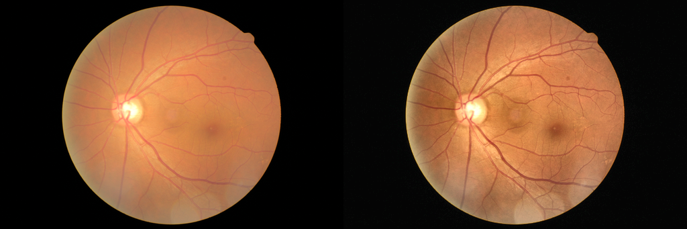

# A Deep Learning Approach To Screen Diabetic Retinopathy from Retinal Fundus Images.
The initial idea of opening this repository was to host the scripts that I created for the Kaggle DR competition. Now, as some of my machine leanring projects are moving to healthcare and telemedicine, I am hoping to use this repo as a place to share not only code, but ideas and findings.

# Data Preprocessing
Majority of the processing is done using CLAHE technique. You can read more about it [here](https://opencv-python-tutroals.readthedocs.io/en/latest/py_tutorials/py_imgproc/py_histograms/py_histogram_equalization/py_histogram_equalization.html) and [here](https://link.springer.com/article/10.1007/BF03178082). It gives a unique contrast improvement over many other techniques I tried. Please take a look at the image below:

